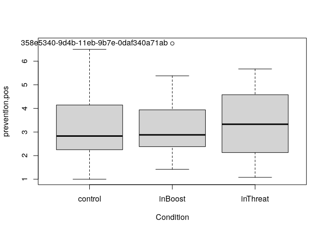
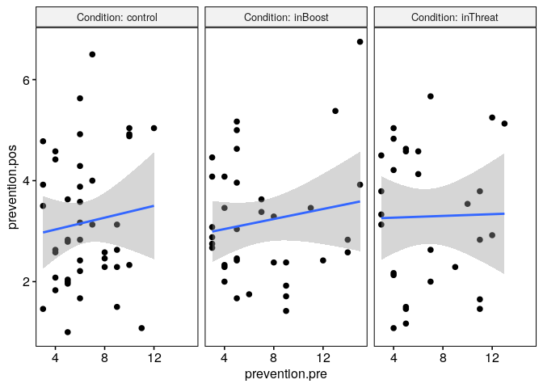
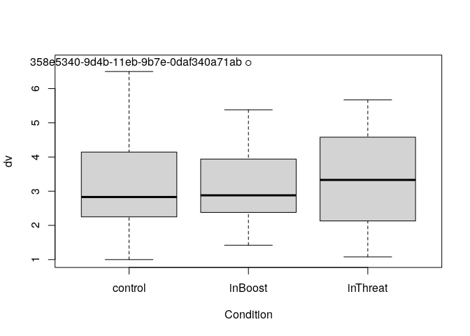
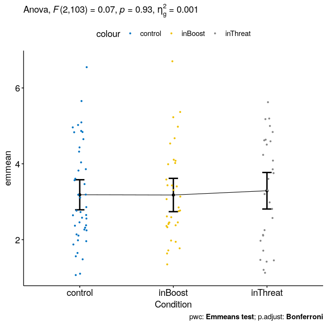

ANCOVA test for `prevention.pos`\~`prevention.pre`+`Condition`
================
Geiser C. Challco <geiser@alumni.usp.br>

-   [Initial Variables and Data](#initial-variables-and-data)
    -   [Descriptive statistics of initial
        data](#descriptive-statistics-of-initial-data)
-   [Checking of Assumptions](#checking-of-assumptions)
    -   [Assumption: Symmetry and treatment of
        outliers](#assumption-symmetry-and-treatment-of-outliers)
    -   [Assumption: Normality distribution of
        data](#assumption-normality-distribution-of-data)
    -   [Assumption: Linearity of dependent variables and covariate
        variable](#assumption-linearity-of-dependent-variables-and-covariate-variable)
    -   [Assumption: Homogeneity of data
        distribution](#assumption-homogeneity-of-data-distribution)
-   [Saving the Data with Normal Distribution Used for Performing ANCOVA
    test](#saving-the-data-with-normal-distribution-used-for-performing-ancova-test)
-   [Computation of ANCOVA test and Pairwise
    Comparison](#computation-of-ancova-test-and-pairwise-comparison)
    -   [ANCOVA test](#ancova-test)
    -   [Pairwise comparison](#pairwise-comparison)
    -   [Descriptive Statistic of Estimated Marginal
        Means](#descriptive-statistic-of-estimated-marginal-means)
    -   [Ancova plots for the dependent variable
        “prevention.pos”](#ancova-plots-for-the-dependent-variable-preventionpos)
    -   [Textual Report](#textual-report)
-   [Tips and References](#tips-and-references)

## Initial Variables and Data

-   R-script file: [../code/ancova.R](../code/ancova.R)
-   Initial table file:
    [../data/initial-table.csv](../data/initial-table.csv)
-   Data for prevention.pos
    [../data/table-for-prevention.pos.csv](../data/table-for-prevention.pos.csv)
-   Table without outliers and normal distribution of data:
    [../data/table-with-normal-distribution.csv](../data/table-with-normal-distribution.csv)
-   Other data files: [../data/](../data/)
-   Files related to the presented results: [../results/](../results/)

### Descriptive statistics of initial data

| Condition | variable       |   n |  mean | median |  min |  max |    sd |    se |    ci |   iqr | symmetry | skewness | kurtosis |
|:----------|:---------------|----:|------:|-------:|-----:|-----:|------:|------:|------:|------:|:---------|---------:|---------:|
| control   | prevention.pos |  43 | 3.173 |   2.83 | 1.00 | 6.50 | 1.317 | 0.201 | 0.405 | 1.895 | YES      |    0.473 |   -0.657 |
| inBoost   | prevention.pos |  35 | 3.189 |   2.88 | 1.42 | 6.75 | 1.211 | 0.205 | 0.416 | 1.560 | NO       |    0.861 |    0.333 |
| inThreat  | prevention.pos |  29 | 3.290 |   3.33 | 1.08 | 5.67 | 1.402 | 0.260 | 0.533 | 2.450 | YES      |   -0.037 |   -1.423 |
| NA        | prevention.pos | 107 | 3.210 |   2.92 | 1.00 | 6.75 | 1.296 | 0.125 | 0.248 | 1.880 | YES      |    0.425 |   -0.610 |

<!-- -->

    ## [1] "358e5340-9d4b-11eb-9b7e-0daf340a71ab"

## Checking of Assumptions

### Assumption: Symmetry and treatment of outliers

#### Applying transformation for skewness data when normality is not achieved

#### Dealing with outliers (performing treatment of outliers)

### Assumption: Normality distribution of data

#### Removing data that affect normality (extreme values)

``` r
non.normal <- list(

)
sdat <- removeFromDataTable(rdat, non.normal, wid)
```

#### Result of normality test in the residual model

|                | var            |   n | skewness | kurtosis | symmetry | statistic | method     |     p | p.signif | normality |
|:---------------|:---------------|----:|---------:|---------:|:---------|----------:|:-----------|------:|:---------|:----------|
| prevention.pos | prevention.pos | 107 |    0.352 |   -0.732 | YES      |     6.207 | D’Agostino | 0.045 | ns       | QQ        |

#### Result of normality test in each group

This is an optional validation and only valid for groups with number
greater than 30 observations

| Condition | variable       |   n |  mean | median |  min |  max |    sd |    se |    ci |   iqr | normality | method       | statistic |     p | p.signif |
|:----------|:---------------|----:|------:|-------:|-----:|-----:|------:|------:|------:|------:|:----------|:-------------|----------:|------:|:---------|
| control   | prevention.pos |  43 | 3.173 |   2.83 | 1.00 | 6.50 | 1.317 | 0.201 | 0.405 | 1.895 | YES       | Shapiro-Wilk |     0.959 | 0.125 | ns       |
| inBoost   | prevention.pos |  35 | 3.189 |   2.88 | 1.42 | 6.75 | 1.211 | 0.205 | 0.416 | 1.560 | YES       | Shapiro-Wilk |     0.939 | 0.051 | ns       |
| inThreat  | prevention.pos |  29 | 3.290 |   3.33 | 1.08 | 5.67 | 1.402 | 0.260 | 0.533 | 2.450 | YES       | Shapiro-Wilk |     0.943 | 0.121 | ns       |

**Observation**:

As sample sizes increase, parametric tests remain valid even with the
violation of normality \[[1](#references)\]. According to the central
limit theorem, the sampling distribution tends to be normal if the
sample is large, more than (`n > 30`) observations. Therefore, we
performed parametric tests with large samples as described as follows:

-   In cases with the sample size greater than 100 (`n > 100`), we
    adopted a significance level of `p < 0.01`

-   For samples with `n > 50` observation, we adopted D’Agostino-Pearson
    test that offers better accuracy for larger samples
    \[[2](#references)\].

-   For samples’ size between `n > 100` and `n <= 200`, we ignored the
    normality test, and our decision of validating normality was based
    only in the interpretation of QQ-plots and histograms because the
    Shapiro-Wilk and D’Agostino-Pearson tests tend to be too sensitive
    with values greater than 200 observation \[[3](#references)\].

-   For samples with `n > 200` observation, we ignore the normality
    assumption based on the central theorem limit.

### Assumption: Linearity of dependent variables and covariate variable

``` r
ggscatter(sdat[["prevention.pos"]], x=covar, y="prevention.pos", facet.by=between, short.panel.labs = F) + 
 stat_smooth(method = "lm", span = 0.9)
```

    ## `geom_smooth()` using formula 'y ~ x'

<!-- -->

### Assumption: Homogeneity of data distribution

|                  | var            | method         | formula             |   n | DFn.df1 | DFd.df2 | statistic |     p | p.signif |
|:-----------------|:---------------|:---------------|:--------------------|----:|--------:|--------:|----------:|------:|:---------|
| prevention.pos.1 | prevention.pos | Levene’s test  | `.res`\~`Condition` | 107 |       2 |     104 |     1.125 | 0.329 | ns       |
| prevention.pos.2 | prevention.pos | Anova’s slopes | `.res`\~`Condition` | 107 |       2 |     101 |     0.122 | 0.886 | ns       |

## Saving the Data with Normal Distribution Used for Performing ANCOVA test

``` r
ndat <- sdat[[1]]
for (dv in names(sdat)[-1]) ndat <- merge(ndat, sdat[[dv]])
write.csv(ndat, paste0("../data/table-with-normal-distribution.csv"))
```

Descriptive statistics of data with normal distribution

|                  | Condition | variable       |   n |  mean | median |  min |  max |    sd |    se |    ci |   iqr |
|:-----------------|:----------|:---------------|----:|------:|-------:|-----:|-----:|------:|------:|------:|------:|
| prevention.pos.1 | control   | prevention.pos |  43 | 3.173 |   2.83 | 1.00 | 6.50 | 1.317 | 0.201 | 0.405 | 1.895 |
| prevention.pos.2 | inBoost   | prevention.pos |  35 | 3.189 |   2.88 | 1.42 | 6.75 | 1.211 | 0.205 | 0.416 | 1.560 |
| prevention.pos.3 | inThreat  | prevention.pos |  29 | 3.290 |   3.33 | 1.08 | 5.67 | 1.402 | 0.260 | 0.533 | 2.450 |

<!-- -->

## Computation of ANCOVA test and Pairwise Comparison

### ANCOVA test

| var            | Effect         | DFn | DFd |  SSn |     SSd |     F |     p |   ges | p.signif |
|:---------------|:---------------|----:|----:|-----:|--------:|------:|------:|------:|:---------|
| prevention.pos | prevention.pre |   1 | 103 | 1.63 | 176.163 | 0.953 | 0.331 | 0.009 | ns       |
| prevention.pos | Condition      |   2 | 103 | 0.25 | 176.163 | 0.073 | 0.929 | 0.001 | ns       |

### Pairwise comparison

| var            | Condition | group1  | group2   | estimate | conf.low | conf.high |    se | statistic |     p | p.adj | p.adj.signif |
|:---------------|:----------|:--------|:---------|---------:|---------:|----------:|------:|----------:|------:|------:|:-------------|
| prevention.pos | NA        | control | inBoost  |    0.006 |   -0.586 |     0.599 | 0.299 |     0.021 | 0.983 |     1 | ns           |
| prevention.pos | NA        | control | inThreat |   -0.106 |   -0.730 |     0.518 | 0.314 |    -0.337 | 0.737 |     1 | ns           |
| prevention.pos | NA        | inBoost | inThreat |   -0.112 |   -0.764 |     0.540 | 0.329 |    -0.341 | 0.734 |     1 | ns           |

### Descriptive Statistic of Estimated Marginal Means

| var            | Condition | prevention.pre | emmean | se.emms |  df | conf.low | conf.high | method       |   n |  mean | median |  min |  max |    sd | se.ds |    ci |   iqr | n.prevention.pre | mean.prevention.pre | median.prevention.pre | min.prevention.pre | max.prevention.pre | sd.prevention.pre | se.prevention.pre | ci.prevention.pre | iqr.prevention.pre | sd.emms |
|:---------------|:----------|---------------:|-------:|--------:|----:|---------:|----------:|:-------------|----:|------:|-------:|-----:|-----:|------:|------:|------:|------:|-----------------:|--------------------:|----------------------:|-------------------:|-------------------:|------------------:|------------------:|------------------:|-------------------:|--------:|
| prevention.pos | control   |          6.664 |  3.183 |   0.200 | 103 |    2.787 |     3.580 | Emmeans test |  43 | 3.173 |   2.83 | 1.00 | 6.50 | 1.317 | 0.201 | 0.405 | 1.895 |               43 |               6.395 |                     6 |                  3 |                 12 |             2.372 |             0.362 |             0.730 |                  3 |   1.310 |
| prevention.pos | inBoost   |          6.664 |  3.177 |   0.221 | 103 |    2.738 |     3.616 | Emmeans test |  35 | 3.189 |   2.88 | 1.42 | 6.75 | 1.211 | 0.205 | 0.416 | 1.560 |               35 |               6.971 |                     5 |                  3 |                 15 |             3.815 |             0.645 |             1.311 |                  5 |   1.310 |
| prevention.pos | inThreat  |          6.664 |  3.289 |   0.243 | 103 |    2.808 |     3.771 | Emmeans test |  29 | 3.290 |   3.33 | 1.08 | 5.67 | 1.402 | 0.260 | 0.533 | 2.450 |               29 |               6.690 |                     5 |                  3 |                 13 |             3.274 |             0.608 |             1.246 |                  6 |   1.308 |

### Ancova plots for the dependent variable “prevention.pos”

``` r
plots <- oneWayAncovaPlots(sdat[["prevention.pos"]], "prevention.pos", between
, aov[["prevention.pos"]], pwc[["prevention.pos"]], addParam = c("jitter"), font.label.size=14, step.increase=0.25)
```

#### Plot for: `prevention.pos` \~ `Condition`

``` r
plots[["Condition"]]
```

<!-- -->

### Textual Report

After controlling the linearity of covariance “prevention.pre”, ANCOVA
tests with independent between-subjects variables “Condition” (inThreat,
inBoost, control) were performed to determine statistically significant
difference on the dependent varibles “prevention.pos”. For the dependent
variable “prevention.pos”, there was not statistically significant
effects.

## Tips and References

-   Use the site <https://www.tablesgenerator.com> to convert the HTML
    tables into Latex format

-   \[2\]: Miot, H. A. (2017). Assessing normality of data in clinical
    and experimental trials. J Vasc Bras, 16(2), 88-91.

-   \[3\]: Bárány, Imre; Vu, Van (2007). “Central limit theorems for
    Gaussian polytopes”. Annals of Probability. Institute of
    Mathematical Statistics. 35 (4): 1593–1621.