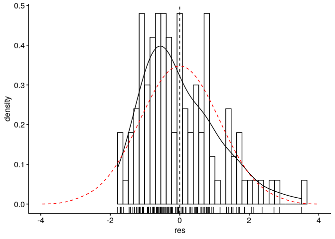
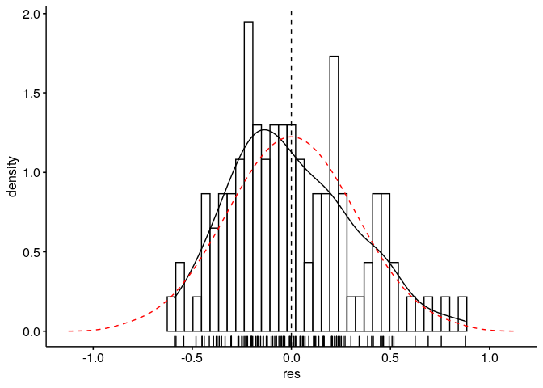

ANCOVA test for `promotion.pos`\~`promotion.pre`+`Condition`
================
Geiser C. Challco <geiser@alumni.usp.br>

-   [Initial Variables and Data](#initial-variables-and-data)
    -   [Descriptive statistics of initial
        data](#descriptive-statistics-of-initial-data)
-   [Checking of Assumptions](#checking-of-assumptions)
    -   [Assumption: Symmetry and treatment of
        outliers](#assumption-symmetry-and-treatment-of-outliers)
    -   [Assumption: Normality distribution of
        data](#assumption-normality-distribution-of-data)
    -   [Assumption: Linearity of dependent variables and covariate
        variable](#assumption-linearity-of-dependent-variables-and-covariate-variable)
    -   [Assumption: Homogeneity of data
        distribution](#assumption-homogeneity-of-data-distribution)
-   [Saving the Data with Normal Distribution Used for Performing ANCOVA
    test](#saving-the-data-with-normal-distribution-used-for-performing-ancova-test)
-   [Computation of ANCOVA test and Pairwise
    Comparison](#computation-of-ancova-test-and-pairwise-comparison)
    -   [ANCOVA test](#ancova-test)
    -   [Pairwise comparison](#pairwise-comparison)
    -   [Descriptive Statistic of Estimated Marginal
        Means](#descriptive-statistic-of-estimated-marginal-means)
    -   [Ancova plots for the dependent variable
        “promotion.pos”](#ancova-plots-for-the-dependent-variable-promotionpos)
    -   [Textual Report](#textual-report)
-   [Tips and References](#tips-and-references)

## Initial Variables and Data

-   R-script file: [../code/ancova.R](../code/ancova.R)
-   Initial table file:
    [../data/initial-table.csv](../data/initial-table.csv)
-   Data for promotion.pos
    [../data/table-for-promotion.pos.csv](../data/table-for-promotion.pos.csv)
-   Table without outliers and normal distribution of data:
    [../data/table-with-normal-distribution.csv](../data/table-with-normal-distribution.csv)
-   Other data files: [../data/](../data/)
-   Files related to the presented results: [../results/](../results/)

### Descriptive statistics of initial data

| Condition | variable      |   n |  mean | median |  min |  max |    sd |    se |    ci |  iqr | symmetry | skewness | kurtosis |
|:----------|:--------------|----:|------:|-------:|-----:|-----:|------:|------:|------:|-----:|:---------|---------:|---------:|
| control   | promotion.pos |  43 | 2.988 |   2.75 | 1.33 | 5.50 | 1.190 | 0.182 | 0.366 | 1.88 | YES      |    0.407 |   -0.922 |
| inBoost   | promotion.pos |  35 | 2.813 |   2.50 | 1.25 | 6.25 | 1.239 | 0.209 | 0.425 | 1.50 | NO       |    1.151 |    0.673 |
| inThreat  | promotion.pos |  29 | 3.122 |   3.04 | 1.25 | 5.67 | 0.959 | 0.178 | 0.365 | 1.13 | YES      |    0.468 |    0.152 |
| NA        | promotion.pos | 107 | 2.967 |   2.92 | 1.25 | 6.25 | 1.145 | 0.111 | 0.219 | 1.71 | NO       |    0.682 |   -0.100 |

<!-- -->

    ## [1] "358e5340-9d4b-11eb-9b7e-0daf340a71ab"
    ## [2] "1160f4b0-a439-11eb-8cbb-599e427a3fce"
    ## [3] "d7092840-efb6-11eb-991d-7bf2f9a6c3b9"

## Checking of Assumptions

### Assumption: Symmetry and treatment of outliers

#### Applying transformation for skewness data when normality is not achieved

Applying transformation in “promotion.pos” to reduce skewness

``` r
density.plot.by.residual(rdat[["promotion.pos"]],"promotion.pos",between,c(),covar)
```

<!-- -->

``` r
rdat[["promotion.pos"]][["promotion.pos"]] <- sqrt(dat[["promotion.pos"]][["promotion.pos"]])

density.plot.by.residual(rdat[["promotion.pos"]],"promotion.pos",between,c(),covar)
```

<!-- -->

#### Dealing with outliers (performing treatment of outliers)

### Assumption: Normality distribution of data

#### Removing data that affect normality (extreme values)

``` r
non.normal <- list(
"promotion.pos" = c("d23aa670-9d47-11eb-9b7e-0daf340a71ab","1160f4b0-a439-11eb-8cbb-599e427a3fce","670fa950-f6e7-11eb-991d-7bf2f9a6c3b9")
)
sdat <- removeFromDataTable(rdat, non.normal, wid)
```

#### Result of normality test in the residual model

|               | var           |   n | skewness | kurtosis | symmetry | statistic | method     |    p | p.signif | normality |
|:--------------|:--------------|----:|---------:|---------:|:---------|----------:|:-----------|-----:|:---------|:----------|
| promotion.pos | promotion.pos | 104 |    0.469 |    -0.14 | YES      |     4.081 | D’Agostino | 0.13 | ns       | QQ        |

#### Result of normality test in each group

This is an optional validation and only valid for groups with number
greater than 30 observations

| Condition | variable      |   n |  mean | median |   min |   max |    sd |    se |    ci |   iqr | normality | method       | statistic |     p | p.signif |
|:----------|:--------------|----:|------:|-------:|------:|------:|------:|------:|------:|------:|:----------|:-------------|----------:|------:|:---------|
| control   | promotion.pos |  43 | 1.695 |  1.658 | 1.153 | 2.345 | 0.345 | 0.053 | 0.106 | 0.556 | YES       | Shapiro-Wilk |     0.960 | 0.142 | ns       |
| inBoost   | promotion.pos |  32 | 1.613 |  1.568 | 1.118 | 2.500 | 0.295 | 0.052 | 0.106 | 0.418 | YES       | Shapiro-Wilk |     0.936 | 0.058 | ns       |
| inThreat  | promotion.pos |  29 | 1.746 |  1.744 | 1.118 | 2.381 | 0.273 | 0.051 | 0.104 | 0.324 | YES       | Shapiro-Wilk |     0.988 | 0.979 | ns       |

**Observation**:

As sample sizes increase, parametric tests remain valid even with the
violation of normality \[[1](#references)\]. According to the central
limit theorem, the sampling distribution tends to be normal if the
sample is large, more than (`n > 30`) observations. Therefore, we
performed parametric tests with large samples as described as follows:

-   In cases with the sample size greater than 100 (`n > 100`), we
    adopted a significance level of `p < 0.01`

-   For samples with `n > 50` observation, we adopted D’Agostino-Pearson
    test that offers better accuracy for larger samples
    \[[2](#references)\].

-   For samples’ size between `n > 100` and `n <= 200`, we ignored the
    normality test, and our decision of validating normality was based
    only in the interpretation of QQ-plots and histograms because the
    Shapiro-Wilk and D’Agostino-Pearson tests tend to be too sensitive
    with values greater than 200 observation \[[3](#references)\].

-   For samples with `n > 200` observation, we ignore the normality
    assumption based on the central theorem limit.

### Assumption: Linearity of dependent variables and covariate variable

``` r
ggscatter(sdat[["promotion.pos"]], x=covar, y="promotion.pos", facet.by=between, short.panel.labs = F) + 
 stat_smooth(method = "lm", span = 0.9)
```

    ## `geom_smooth()` using formula 'y ~ x'

<!-- -->

### Assumption: Homogeneity of data distribution

|                 | var           | method         | formula             |   n | DFn.df1 | DFd.df2 | statistic |     p | p.signif |
|:----------------|:--------------|:---------------|:--------------------|----:|--------:|--------:|----------:|------:|:---------|
| promotion.pos.1 | promotion.pos | Levene’s test  | `.res`\~`Condition` | 104 |       2 |     101 |     1.459 | 0.237 | ns       |
| promotion.pos.2 | promotion.pos | Anova’s slopes | `.res`\~`Condition` | 104 |       2 |      98 |     0.829 | 0.439 | ns       |

## Saving the Data with Normal Distribution Used for Performing ANCOVA test

``` r
ndat <- sdat[[1]]
for (dv in names(sdat)[-1]) ndat <- merge(ndat, sdat[[dv]])
write.csv(ndat, paste0("../data/table-with-normal-distribution.csv"))
```

Descriptive statistics of data with normal distribution

|                 | Condition | variable      |   n |  mean | median |   min |   max |    sd |    se |    ci |   iqr |
|:----------------|:----------|:--------------|----:|------:|-------:|------:|------:|------:|------:|------:|------:|
| promotion.pos.1 | control   | promotion.pos |  43 | 1.695 |  1.658 | 1.153 | 2.345 | 0.345 | 0.053 | 0.106 | 0.556 |
| promotion.pos.2 | inBoost   | promotion.pos |  32 | 1.613 |  1.568 | 1.118 | 2.500 | 0.295 | 0.052 | 0.106 | 0.418 |
| promotion.pos.3 | inThreat  | promotion.pos |  29 | 1.746 |  1.744 | 1.118 | 2.381 | 0.273 | 0.051 | 0.104 | 0.324 |

<!-- -->

## Computation of ANCOVA test and Pairwise Comparison

### ANCOVA test

| var           | Effect        | DFn | DFd |   SSn |   SSd |     F |     p |   ges | p.signif |
|:--------------|:--------------|----:|----:|------:|------:|------:|------:|------:|:---------|
| promotion.pos | promotion.pre |   1 | 100 | 0.846 | 8.923 | 9.484 | 0.003 | 0.087 | \*\*     |
| promotion.pos | Condition     |   2 | 100 | 0.161 | 8.923 | 0.904 | 0.408 | 0.018 | ns       |

### Pairwise comparison

| var           | Condition | group1  | group2   | estimate | conf.low | conf.high |    se | statistic |     p | p.adj | p.adj.signif |
|:--------------|:----------|:--------|:---------|---------:|---------:|----------:|------:|----------:|------:|------:|:-------------|
| promotion.pos | NA        | control | inBoost  |    0.035 |   -0.107 |     0.177 | 0.071 |     0.491 | 0.624 | 1.000 | ns           |
| promotion.pos | NA        | control | inThreat |   -0.067 |   -0.210 |     0.076 | 0.072 |    -0.931 | 0.354 | 1.000 | ns           |
| promotion.pos | NA        | inBoost | inThreat |   -0.102 |   -0.255 |     0.051 | 0.077 |    -1.321 | 0.190 | 0.569 | ns           |

### Descriptive Statistic of Estimated Marginal Means

| var           | Condition | promotion.pre | emmean | se.emms |  df | conf.low | conf.high | method       |   n |  mean | median |   min |   max |    sd | se.ds |    ci |   iqr | n.promotion.pre | mean.promotion.pre | median.promotion.pre | min.promotion.pre | max.promotion.pre | sd.promotion.pre | se.promotion.pre | ci.promotion.pre | iqr.promotion.pre | sd.emms |
|:--------------|:----------|--------------:|-------:|--------:|----:|---------:|----------:|:-------------|----:|------:|-------:|------:|------:|------:|------:|------:|------:|----------------:|-------------------:|---------------------:|------------------:|------------------:|-----------------:|-----------------:|-----------------:|------------------:|--------:|
| promotion.pos | control   |          3.34 |  1.676 |   0.046 | 100 |    1.585 |     1.767 | Emmeans test |  43 | 1.695 |  1.658 | 1.153 | 2.345 | 0.345 | 0.053 | 0.106 | 0.556 |              43 |              3.178 |                 3.33 |              1.00 |              4.67 |            0.765 |            0.117 |            0.235 |             1.000 |   0.301 |
| promotion.pos | inBoost   |          3.34 |  1.641 |   0.054 | 100 |    1.535 |     1.747 | Emmeans test |  32 | 1.613 |  1.568 | 1.118 | 2.500 | 0.295 | 0.052 | 0.106 | 0.418 |              32 |              3.585 |                 3.67 |              2.33 |              4.67 |            0.605 |            0.107 |            0.218 |             0.752 |   0.303 |
| promotion.pos | inThreat  |          3.34 |  1.743 |   0.055 | 100 |    1.633 |     1.853 | Emmeans test |  29 | 1.746 |  1.744 | 1.118 | 2.381 | 0.273 | 0.051 | 0.104 | 0.324 |              29 |              3.310 |                 3.67 |              1.67 |              5.00 |            0.996 |            0.185 |            0.379 |             1.670 |   0.299 |

### Ancova plots for the dependent variable “promotion.pos”

``` r
plots <- oneWayAncovaPlots(sdat[["promotion.pos"]], "promotion.pos", between
, aov[["promotion.pos"]], pwc[["promotion.pos"]], addParam = c("jitter"), font.label.size=14, step.increase=0.25)
```

#### Plot for: `promotion.pos` \~ `Condition`

``` r
plots[["Condition"]]
```

<!-- -->

### Textual Report

After controlling the linearity of covariance “promotion.pre”, ANCOVA
tests with independent between-subjects variables “Condition” (inThreat,
inBoost, control) were performed to determine statistically significant
difference on the dependent varibles “promotion.pos”. For the dependent
variable “promotion.pos”, there was statistically significant effects in
the factor “promotion.pre” with F(1,100)=9.484, p=0.003 and ges=0.087
(effect size).

## Tips and References

-   Use the site <https://www.tablesgenerator.com> to convert the HTML
    tables into Latex format

-   \[2\]: Miot, H. A. (2017). Assessing normality of data in clinical
    and experimental trials. J Vasc Bras, 16(2), 88-91.

-   \[3\]: Bárány, Imre; Vu, Van (2007). “Central limit theorems for
    Gaussian polytopes”. Annals of Probability. Institute of
    Mathematical Statistics. 35 (4): 1593–1621.