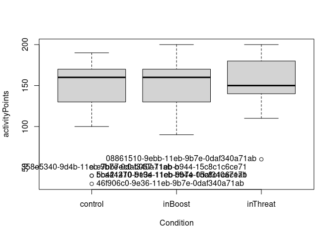
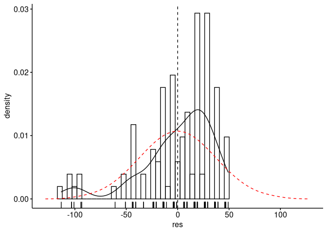
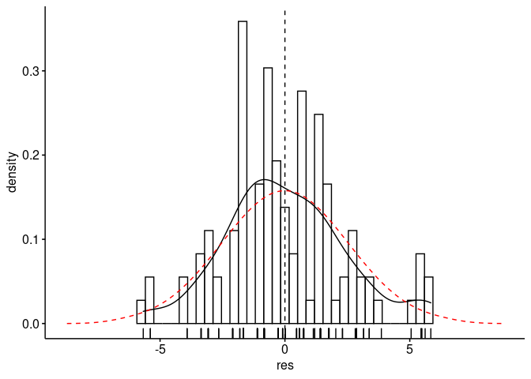
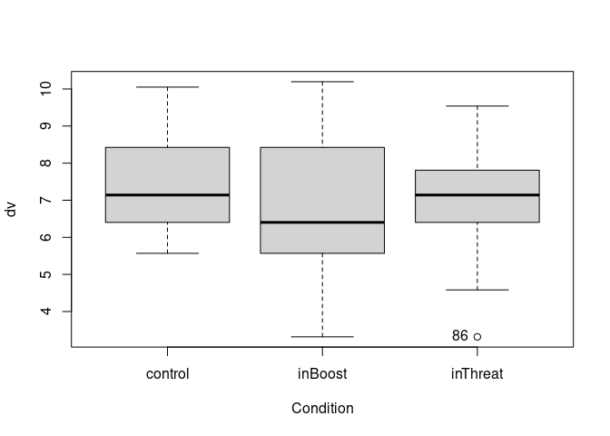
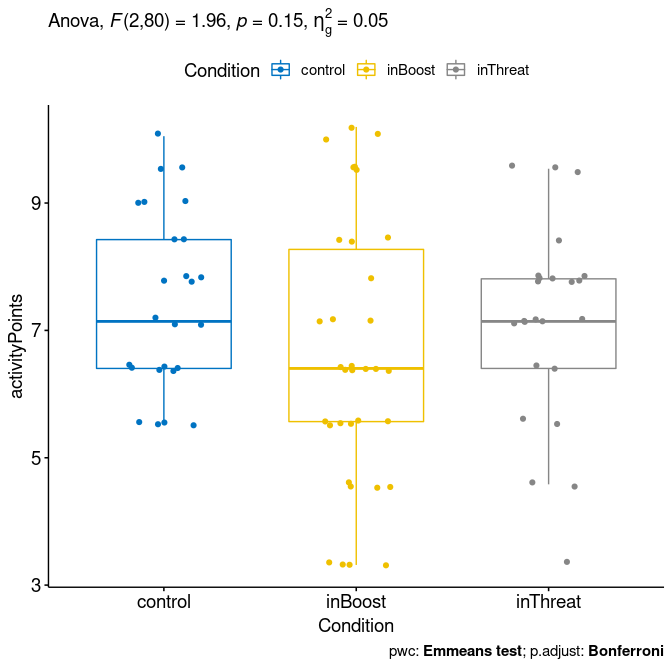

ANOVA test for `activityPoints`\~`Condition`
================
Geiser C. Challco <geiser@alumni.usp.br>

-   [Initial Variables and Data](#initial-variables-and-data)
    -   [Descriptive statistics of initial
        data](#descriptive-statistics-of-initial-data)
-   [Checking of Assumptions](#checking-of-assumptions)
    -   [Assumption: Symmetry and treatment of
        outliers](#assumption-symmetry-and-treatment-of-outliers)
    -   [Assumption: Normality distribution of
        data](#assumption-normality-distribution-of-data)
    -   [Assumption: Homogeneity of data
        distribution](#assumption-homogeneity-of-data-distribution)
-   [Saving the Data with Normal Distribution Used for Performing ANOVA
    test](#saving-the-data-with-normal-distribution-used-for-performing-anova-test)
-   [Computation of ANOVA test and Pairwise
    Comparison](#computation-of-anova-test-and-pairwise-comparison)
    -   [ANOVA test](#anova-test)
    -   [Pairwise comparison](#pairwise-comparison)
    -   [Descriptive Statistic of Estimated Marginal
        Means](#descriptive-statistic-of-estimated-marginal-means)
    -   [Anova plots for the dependent variable
        “activityPoints”](#anova-plots-for-the-dependent-variable-activitypoints)
    -   [Textual Report](#textual-report)
-   [Tips and References](#tips-and-references)

## Initial Variables and Data

-   R-script file: [../code/anova.R](../code/anova.R)
-   Initial table file:
    [../data/initial-table.csv](../data/initial-table.csv)
-   Data for activityPoints
    [../data/table-for-activityPoints.csv](../data/table-for-activityPoints.csv)
-   Table without outliers and normal distribution of data:
    [../data/table-with-normal-distribution.csv](../data/table-with-normal-distribution.csv)
-   Other data files: [../data/](../data/)
-   Files related to the presented results: [../results/](../results/)

### Descriptive statistics of initial data

| Condition | variable       |   n |    mean | median | min | max |     sd |    se |     ci | iqr | symmetry | skewness | kurtosis |
|:----------|:---------------|----:|--------:|-------:|----:|----:|-------:|------:|-------:|----:|:---------|---------:|---------:|
| control   | activityPoints |  43 | 143.256 |    160 |  30 | 190 | 39.804 | 6.070 | 12.250 |  40 | NO       |   -1.514 |    1.576 |
| inBoost   | activityPoints |  35 | 150.857 |    160 |  50 | 200 | 33.727 | 5.701 | 11.585 |  40 | NO       |   -0.970 |    0.448 |
| inThreat  | activityPoints |  29 | 154.138 |    150 |  60 | 200 | 30.533 | 5.670 | 11.614 |  40 | NO       |   -0.751 |    1.096 |
| NA        | activityPoints | 107 | 148.692 |    160 |  30 | 200 | 35.504 | 3.432 |  6.805 |  30 | NO       |   -1.344 |    1.913 |

<!-- -->

    ## [1] "bb421410-9e34-11eb-9b7e-0daf340a71ab" "46f906c0-9e36-11eb-9b7e-0daf340a71ab" "e7bb7ec0-b057-11eb-b944-15c8c1c6ce71"
    ## [4] "5ca44270-b19e-11eb-b944-15c8c1c6ce71" "358e5340-9d4b-11eb-9b7e-0daf340a71ab" "08861510-9ebb-11eb-9b7e-0daf340a71ab"

## Checking of Assumptions

### Assumption: Symmetry and treatment of outliers

#### Applying transformation for skewness data when normality is not achieved

Applying transformation in “activityPoints” to reduce skewness

``` r
density.plot.by.residual(rdat[["activityPoints"]],"activityPoints",between)
```

<!-- -->

``` r
rdat[["activityPoints"]][["activityPoints"]] <- sqrt(max(dat[["activityPoints"]][["activityPoints"]]+1) - dat[["activityPoints"]][["activityPoints"]])
density.plot.by.residual(rdat[["activityPoints"]],"activityPoints",between)
```

<!-- -->

#### Dealing with outliers (performing treatment of outliers)

``` r
rdat[["activityPoints"]] <- winzorize(rdat[["activityPoints"]],"activityPoints", c("Condition"))
```

### Assumption: Normality distribution of data

#### Removing data that affect normality (extreme values)

``` r
non.normal <- list(
"activityPoints" = c("bb421410-9e34-11eb-9b7e-0daf340a71ab","46f906c0-9e36-11eb-9b7e-0daf340a71ab","a4947eb0-a456-11eb-8cbb-599e427a3fce","eb7bfbc0-a79c-11eb-8cbb-599e427a3fce","d7506eb0-a81e-11eb-8cbb-599e427a3fce","a9467110-a853-11eb-8cbb-599e427a3fce","e7bb7ec0-b057-11eb-b944-15c8c1c6ce71","5ca44270-b19e-11eb-b944-15c8c1c6ce71","16027280-b1dd-11eb-b944-15c8c1c6ce71","8eba26c0-b1ea-11eb-b944-15c8c1c6ce71","108b6210-b649-11eb-ad27-3593da35795f","b86c5a00-c0be-11eb-93e6-43229aa359ae","b7ecef30-dbf9-11eb-916d-ef9a5fc9a834","890928c0-df62-11eb-bf23-972ef7bdc96c","2145a1e0-df63-11eb-bf23-972ef7bdc96c","d9957860-df63-11eb-bf23-972ef7bdc96c","b42f8980-efb7-11eb-991d-7bf2f9a6c3b9","9d1ee580-f6ea-11eb-991d-7bf2f9a6c3b9","169a9c00-9e22-11eb-9b7e-0daf340a71ab","9186bb20-a47f-11eb-8cbb-599e427a3fce","d7a07110-df61-11eb-bf23-972ef7bdc96c","67a97540-df62-11eb-bf23-972ef7bdc96c","7cc13d00-df62-11eb-bf23-972ef7bdc96c","412915a0-df63-11eb-bf23-972ef7bdc96c")
)
sdat <- removeFromDataTable(rdat, non.normal, wid)
```

#### Result of normality test in the residual model

|                | var            |   n | skewness | kurtosis | symmetry | statistic | method     |     p | p.signif | normality |
|:---------------|:---------------|----:|---------:|---------:|:---------|----------:|:-----------|------:|:---------|:----------|
| activityPoints | activityPoints |  83 |    0.056 |   -0.492 | YES      |      0.57 | D’Agostino | 0.752 | ns       | YES       |

#### Result of normality test in each group

This is an optional validation and only valid for groups with number
greater than 30 observations

| Condition | variable       |   n |  mean | median |   min |    max |    sd |    se |    ci |   iqr | normality | method       | statistic |     p | p.signif |
|:----------|:---------------|----:|------:|-------:|------:|-------:|------:|------:|------:|------:|:----------|:-------------|----------:|------:|:---------|
| control   | activityPoints |  25 | 7.453 |  7.141 | 5.568 | 10.050 | 1.387 | 0.277 | 0.572 | 2.023 | YES       | Shapiro-Wilk |     0.930 | 0.088 | ns       |
| inBoost   | activityPoints |  34 | 6.566 |  6.403 | 3.317 | 10.196 | 2.067 | 0.355 | 0.721 | 2.704 | YES       | Shapiro-Wilk |     0.941 | 0.064 | ns       |
| inThreat  | activityPoints |  24 | 7.125 |  7.141 | 3.317 |  9.539 | 1.557 | 0.318 | 0.658 | 1.407 | YES       | Shapiro-Wilk |     0.924 | 0.073 | ns       |

**Observation**:

As sample sizes increase, parametric tests remain valid even with the
violation of normality \[[1](#references)\]. According to the central
limit theorem, the sampling distribution tends to be normal if the
sample is large, more than (`n > 30`) observations. Therefore, we
performed parametric tests with large samples as described as follows:

-   In cases with the sample size greater than 100 (`n > 100`), we
    adopted a significance level of `p < 0.01`

-   For samples with `n > 50` observation, we adopted D’Agostino-Pearson
    test that offers better accuracy for larger samples
    \[[2](#references)\].

-   For samples’ size between `n > 100` and `n <= 200`, we ignored the
    normality test, and our decision of validating normality was based
    only in the interpretation of QQ-plots and histograms because the
    Shapiro-Wilk and D’Agostino-Pearson tests tend to be too sensitive
    with values greater than 200 observation \[[3](#references)\].

-   For samples with `n > 200` observation, we ignore the normality
    assumption based on the central theorem limit.

### Assumption: Homogeneity of data distribution

|                | var            | method        | formula                       |   n | df1 | df2 | statistic |     p | p.signif |
|:---------------|:---------------|:--------------|:------------------------------|----:|----:|----:|----------:|------:|:---------|
| activityPoints | activityPoints | Levene’s test | `activityPoints`\~`Condition` |  83 |   2 |  80 |     1.906 | 0.155 | ns       |

## Saving the Data with Normal Distribution Used for Performing ANOVA test

``` r
ndat <- sdat[[1]]
for (dv in names(sdat)[-1]) ndat <- merge(ndat, sdat[[dv]])
write.csv(ndat, paste0("../data/table-with-normal-distribution.csv"))
```

Descriptive statistics of data with normal distribution

|                  | Condition | variable       |   n |  mean | median |   min |    max |    sd |    se |    ci |   iqr |
|:-----------------|:----------|:---------------|----:|------:|-------:|------:|-------:|------:|------:|------:|------:|
| activityPoints.1 | control   | activityPoints |  25 | 7.453 |  7.141 | 5.568 | 10.050 | 1.387 | 0.277 | 0.572 | 2.023 |
| activityPoints.2 | inBoost   | activityPoints |  34 | 6.566 |  6.403 | 3.317 | 10.196 | 2.067 | 0.355 | 0.721 | 2.704 |
| activityPoints.3 | inThreat  | activityPoints |  24 | 7.125 |  7.141 | 3.317 |  9.539 | 1.557 | 0.318 | 0.658 | 1.407 |

<!-- -->

## Computation of ANOVA test and Pairwise Comparison

### ANOVA test

| var            | Effect    | DFn | DFd |    SSn |     SSd |    F |     p |   ges | p.signif |
|:---------------|:----------|----:|----:|-------:|--------:|-----:|------:|------:|:---------|
| activityPoints | Condition |   2 |  80 | 11.907 | 242.976 | 1.96 | 0.148 | 0.047 | ns       |

### Pairwise comparison

| var            | group1  | group2   | estimate | conf.low | conf.high |    se | statistic |     p | p.adj | p.adj.signif |
|:---------------|:--------|:---------|---------:|---------:|----------:|------:|----------:|------:|------:|:-------------|
| activityPoints | control | inBoost  |    0.887 |   -0.027 |     1.801 | 0.459 |     1.932 | 0.057 | 0.171 | ns           |
| activityPoints | control | inThreat |    0.329 |   -0.662 |     1.320 | 0.498 |     0.660 | 0.511 | 1.000 | ns           |
| activityPoints | inBoost | inThreat |   -0.558 |   -1.483 |     0.366 | 0.465 |    -1.202 | 0.233 | 0.699 | ns           |

### Descriptive Statistic of Estimated Marginal Means

| var            | Condition |   n | emmean |  mean | conf.low | conf.high |    sd | sd.emms | se.emms |
|:---------------|:----------|----:|-------:|------:|---------:|----------:|------:|--------:|--------:|
| activityPoints | control   |  25 |  7.453 | 7.453 |    6.760 |     8.147 | 1.387 |   1.743 |   0.349 |
| activityPoints | inBoost   |  34 |  6.566 | 6.566 |    5.971 |     7.161 | 2.067 |   1.743 |   0.299 |
| activityPoints | inThreat  |  24 |  7.125 | 7.125 |    6.417 |     7.832 | 1.557 |   1.743 |   0.356 |

### Anova plots for the dependent variable “activityPoints”

``` r
plots <- oneWayAnovaPlots(sdat[["activityPoints"]], "activityPoints", between, aov[["activityPoints"]], pwc[["activityPoints"]], c("jitter"), font.label.size=14, step.increase=0.25)
```

#### Plot of “activityPoints” based on “Condition”

``` r
plots[["Condition"]]
```

<!-- -->

### Textual Report

ANOVA tests with independent between-subjects variables “Condition”
(control, inBoost, inThreat) were performed to determine statistically
significant difference on the dependent varibles “activityPoints”. For
the dependent variable “activityPoints”, there was not statistically
significant effects.

## Tips and References

-   Use the site <https://www.tablesgenerator.com> to convert the HTML
    tables into Latex format

-   \[2\]: Miot, H. A. (2017). Assessing normality of data in clinical
    and experimental trials. J Vasc Bras, 16(2), 88-91.

-   \[3\]: Bárány, Imre; Vu, Van (2007). “Central limit theorems for
    Gaussian polytopes”. Annals of Probability. Institute of
    Mathematical Statistics. 35 (4): 1593–1621.